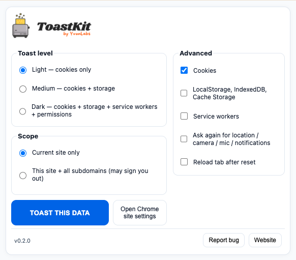
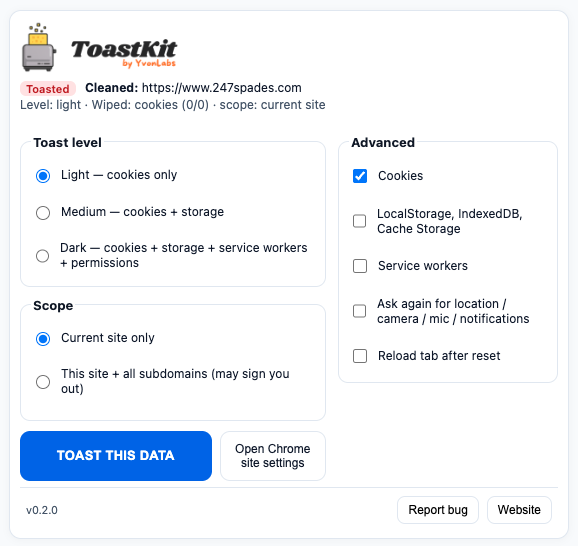

   
  <b>ToastKit - reset one site, not your entire browser.</b> Clear cookies, cache, and storage for the site you're on.

  
  
  
  

---

**A Chrome extension by [YvonLabs](https://yvonlabs.github.io)**  
Reset cookies, cache, storage, and permissions for the current site without touching the rest of your browser.

ToastKit began as a simple script to reset one domain during testing. I refined it into a lightweight tool for anyone who needs a quick, contained reset without losing other sessions.

---

## Features
- **Targeted control** - reset data only for the current site or include subdomains.
- **Granular options** - choose which data to clear: cookies, cache, localStorage, or sessionStorage.
- **Instant feedback** - see what was reset after each action.
- **Keyboard shortcut** - press **Alt + T** to instantly reset the current site.  
- **Simple interface** - one click, one site, nothing else touched.

---

## How It Works
ToastKit uses Chrome’s privacy APIs to selectively clear cookies, cache, and storage only for the active domain. It gives you a clean slate without affecting other tabs or logins.

---

## Interface Preview
| Popup | Toasted State |
|:--:|:--:|
|  |  |

---

## Installation
For local development or manual installation:

1. Clone or download this repository.  
2. Open Chrome and go to `chrome://extensions/`.  
3. Enable **Developer Mode** in the top right corner.  
4. Click **Load unpacked** and select your **ToastKit** folder.  
5. The  ToastKit icon will appear in your toolbar.

---

## Usage
1. Visit any site.  
2. Click the **ToastKit** icon.
3. Select what to reset.  
4. Click **TOAST THIS SITE**.

---

## Support & Feedback
- 🐞 [Report a bug](https://github.com/YvonLabs/toastkit/issues/new?template=bug_report.md)
- ✨ [Request a feature](https://github.com/YvonLabs/toastkit/issues/new?template=feature_request.md)
- 🌐 [Visit YvonLabs website](https://yvonlabs.github.io)

---

## Credits
Created by **YvonLabs** - building EU-centric, privacy-respecting tools.  
Logo & design by [YvonLabs](https://yvonlabs.github.io).  
Licensed under the **MIT License**.

---

## Technical Stack
- Chrome Extension (Manifest V3)  
- Service-worker background script (`background.js`, module-based)  
- Popup UI built with plain HTML, CSS, and vanilla JavaScript  
- Uses Chrome APIs:  
  - `chrome.browsingData` - clear cookies, cache, and storage for the current site  
  - `chrome.cookies` - inspect or remove cookies  
  - `chrome.contentSettings` - reset site permissions (camera, mic, notifications)  
  - `chrome.storage` - save user preferences for what to reset  
  - `chrome.tabs` / `chrome.activeTab` - detect the active site  
  - `chrome.commands` - enable keyboard shortcuts (Alt + T)

---

## Changelog
**v0.2.0**
- Restored “Toasted” visual feedback 🔥  
- Added cookie count details (e.g., 7/7)  
- Improved advanced control sync  
- Refined visual padding and popup layout  

---

## Stay Updated
Follow updates and other projects from YvonLabs at  
👉 [https://yvonlabs.github.io](https://yvonlabs.github.io)

---

### Support YvonLabs

If you find ToastKit helpful, you can support future open-source tools:

☕ https://buymeacoffee.com/yvonlabs

  Minimal • Fast • Focused © YvonLabs

